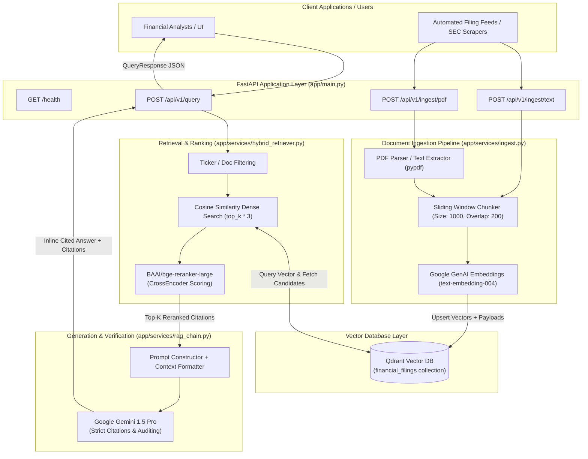
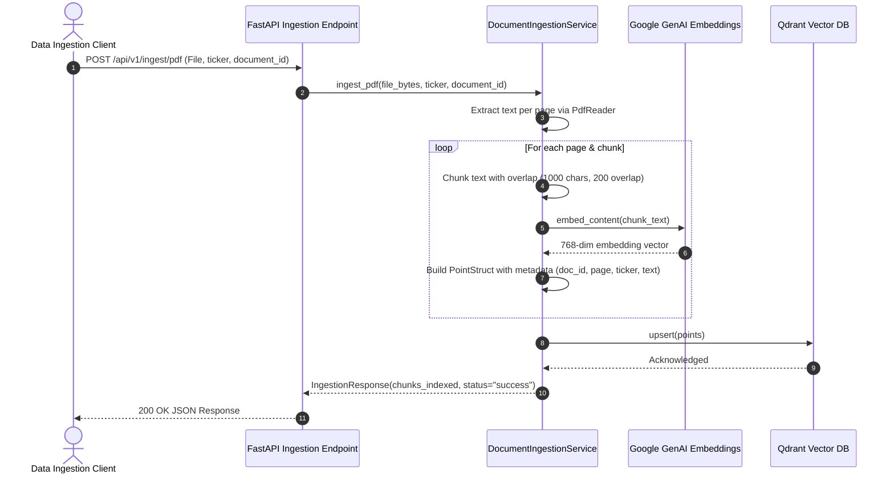
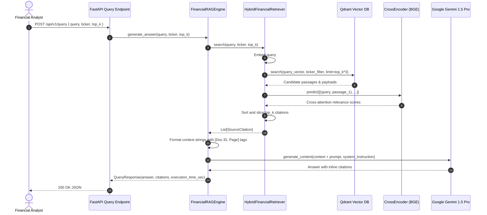

# Financial Earnings RAG Intelligence System

Production-grade, low-latency Financial Earnings RAG and disclosure analysis pipeline built with FastAPI, Qdrant vector database, CrossEncoder reranking, and Google Gemini.

---

## 🏗️ System Architecture



---

## 🔄 End-to-End Operational Workflow

The system is organized into two primary end-to-end workflows:

### 1. Document Ingestion & Indexing Pipeline



- **Extraction & Chunking**: Financial documents (PDF 10-Ks, 10-Qs, transcripts) or plain text are processed by `DocumentIngestionService`, chunked using a sliding window (1000 chars with 200 character overlap) while preserving page numbers and document identifiers.
- **Embedding**: Generates 768-dimensional dense vectors via Google GenAI (`text-embedding-004`).
- **Upsert**: Stores vectors with payload metadata into Qdrant's `financial_filings` collection.

---

### 2. Query Retrieval, Re-ranking & Answer Generation Pipeline



- **Query Embedding & Search**: User submits a financial question (with optional ticker filter). The query is embedded and matched against Qdrant to retrieve `top_k * 3` candidates.
- **Cross-Encoder Re-ranking**: Candidates are re-scored using `BAAI/bge-reranker-large` cross-attention to eliminate false positives and order passages by semantic relevance.
- **Context Injection & LLM Synthesis**: The top passages are formatted into structured context blocks `[Doc: <ID>, Page: <N>]` and passed to Google Gemini 1.5 Pro with strict instructions requiring inline citations for all assertions.

---

## 📁 Project Structure

```text
financial_rag_system/
├── app/
│   ├── __init__.py
│   ├── main.py                  # FastAPI entry point & health check
│   ├── api/
│   │   ├── __init__.py
│   │   └── v1/
│   │       ├── router.py        # API router aggregation
│   │       └── endpoints.py     # Endpoints for query & ingestion
│   ├── core/
│   │   ├── config.py            # Pydantic Settings
│   │   └── security.py          # API key security
│   ├── services/
│   │   ├── ingest.py            # PDF / text ingestion and chunking
│   │   ├── hybrid_retriever.py  # Qdrant retrieval + reranking
│   │   ├── reranker.py          # BGE CrossEncoder wrapper
│   │   └── rag_chain.py         # Gemini RAG generation chain
│   └── models/
│       └── schemas.py           # Pydantic schemas
├── tests/
│   ├── test_ingest.py           # Ingestion unit tests
│   └── test_rag.py              # RAG generation unit tests
├── docker-compose.yml           # Multi-container orchestration
├── Dockerfile                   # Multi-stage production container
├── requirements.txt             # Python dependencies
├── .env.example                 # Sample configuration
└── README.md
```

---

## 🚀 Getting Started

### 1. Environment Setup

Copy `.env.example` to `.env` and set your credentials:

```bash
cp .env.example .env
```

Edit `.env`:
```ini
PROJECT_NAME="Financial Earnings RAG Intelligence"
GEMINI_API_KEY=your_gemini_api_key_here
QDRANT_HOST=localhost
QDRANT_PORT=6333
COLLECTION_NAME=financial_filings
```

### 2. Local Installation

```bash
# Create and activate virtual environment
python -m venv .venv
source .venv/bin/activate  # On Windows: .venv\Scripts\activate

# Install dependencies
pip install -r requirements.txt
```

### 3. Run with Docker Compose

To spin up both Qdrant vector database and the FastAPI application:

```bash
docker-compose up --build
```

### 4. Run API Locally

Ensure Qdrant is running on port 6333, then start the FastAPI server:

```bash
uvicorn app.main:app --host 0.0.0.0 --port 8000 --reload
```

Interactive API documentation will be available at:
- **Swagger UI**: `http://localhost:8000/docs`
- **ReDoc**: `http://localhost:8000/redoc`

---

## 🧪 Testing

Run the test suite with pytest:

```bash
pytest tests/ -v
```

---

## 📡 API Endpoints

| Method | Endpoint | Description |
|---|---|---|
| `GET` | `/health` | Health check endpoint |
| `POST` | `/api/v1/query` | Execute financial question answering with citations |
| `POST` | `/api/v1/ingest/text` | Ingest raw financial text |
| `POST` | `/api/v1/ingest/pdf` | Upload and ingest PDF report (10-K, 10-Q) |
